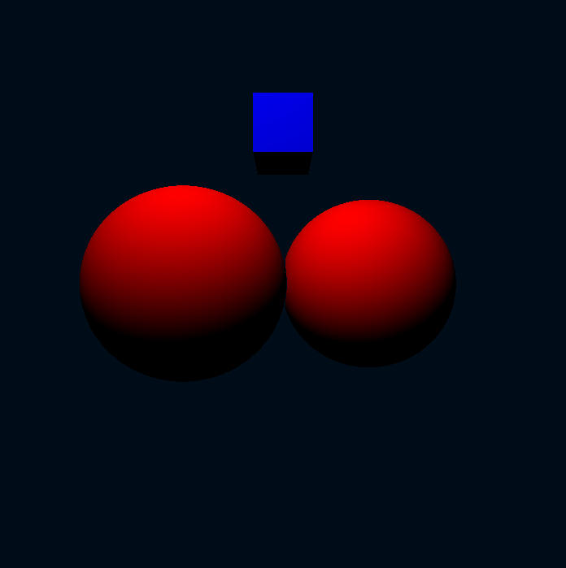

# RayMarching-Demo
A simple raymarching renderer written in C++ using OpenGL.

In raymarching, object geometries are represented by a distance function instead of vertices. This distance function will take a point in space as input, and will output the distance to the nearest object. Rays are cast from the camera through each pixel, and evaluating the value of the distance function at points along this ray allows you to see whether that ray approaches an object. 

The renderer checks points along the ray at distances in increments of the distance to the nearest object. If the distance function converges to 0 as you move along the ray, it has hit an object, which will be displayed by the pixel that the ray originated from. If the distance increases without bound as you continue along the ray, then it has missed the objects, and the pixel will display accordingly.
